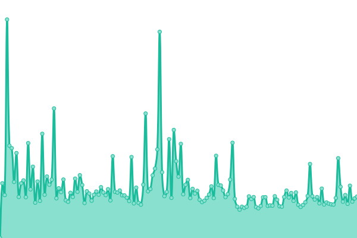
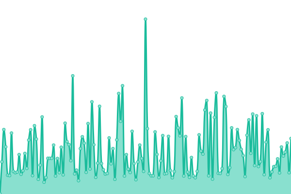

# [📈 Live Status](https://status.star-citizen.wiki): <!--live status--> **🟧 Partial outage**

This repository contains the open-source uptime monitor and status page for [Star Citizen Wiki](https://star-citizen.wiki), powered by [Upptime](https://github.com/upptime/upptime).

With [Upptime](https://upptime.js.org), you can get your own unlimited and free uptime monitor and status page, powered entirely by a GitHub repository. We use [Issues](https://github.com/StarCitizenWiki/status/issues) as incident reports, [Actions](https://github.com/StarCitizenWiki/status/actions) as uptime monitors, and [Pages](https://status.star-citizen.wiki) for the status page.

<!--start: status pages-->
<!-- This summary is generated by Upptime (https://github.com/upptime/upptime) -->
<!-- Do not edit this manually, your changes will be overwritten -->
<!-- prettier-ignore -->
| URL | Status | History | Response Time | Uptime |
| --- | ------ | ------- | ------------- | ------ |
|  [Star Citizen Wiki](https://star-citizen.wiki) | 🟥 Down | [star-citizen-wiki.yml](https://github.com/StarCitizenWiki/status/commits/HEAD/history/star-citizen-wiki.yml) | 

 798ms
     
 | 

<a href="https://status.star-citizen.wiki/history/star-citizen-wiki">99.19%</a>
    

|  [Star Citizen Wiki CDN](https://cdn.star-citizen.wiki) | 🟩 Up | [star-citizen-wiki-cdn.yml](https://github.com/StarCitizenWiki/status/commits/HEAD/history/star-citizen-wiki-cdn.yml) | 

 589ms
     
 | 

<a href="https://status.star-citizen.wiki/history/star-citizen-wiki-cdn">100.00%</a>
    

|  [Star Citizen Wiki API](https://api.star-citizen.wiki) | 🟥 Down | [star-citizen-wiki-api.yml](https://github.com/StarCitizenWiki/status/commits/HEAD/history/star-citizen-wiki-api.yml) | 

 569ms
     
 | 

<a href="https://status.star-citizen.wiki/history/star-citizen-wiki-api">99.17%</a>
    

|  [Parsoid](https://star-citizen.wiki/api.php?action=visualeditor&format=json&paction=parse&page=Star_Citizen_Wiki) | 🟥 Down | [parsoid.yml](https://github.com/StarCitizenWiki/status/commits/HEAD/history/parsoid.yml) | 

 143ms
     
 | 

<a href="https://status.star-citizen.wiki/history/parsoid">99.16%</a>
    

|  [Star Citizen Wiki Docs](https://docs.star-citizen.wiki) | 🟥 Down | [star-citizen-wiki-docs.yml](https://github.com/StarCitizenWiki/status/commits/HEAD/history/star-citizen-wiki-docs.yml) | 

 218ms
     
 | 

<a href="https://status.star-citizen.wiki/history/star-citizen-wiki-docs">99.15%</a>
    

|  [Star Citizen Wiki Analytics](https://analytics.star-citizen.wiki) | 🟥 Down | [star-citizen-wiki-analytics.yml](https://github.com/StarCitizenWiki/status/commits/HEAD/history/star-citizen-wiki-analytics.yml) | 

 658ms
     
 | 

<a href="https://status.star-citizen.wiki/history/star-citizen-wiki-analytics">99.14%</a>
    

|  [Star Citizen Wiki Archiv](https://archiv.star-citizen.wiki) | 🟥 Down | [star-citizen-wiki-archiv.yml](https://github.com/StarCitizenWiki/status/commits/HEAD/history/star-citizen-wiki-archiv.yml) | 

 1013ms
     
 | 

<a href="https://status.star-citizen.wiki/history/star-citizen-wiki-archiv">99.14%</a>
    

|  [Action API](https://star-citizen.wiki/api.php?action=query&prop=info&titles=Gladius) | 🟥 Down | [action-api.yml](https://github.com/StarCitizenWiki/status/commits/HEAD/history/action-api.yml) | 

 146ms
     
 | 

<a href="https://status.star-citizen.wiki/history/action-api">99.13%</a>
    

<!--end: status pages-->

[**Visit our status website →**](https://status.star-citizen.wiki)

## 📄 License

- Powered by: [Upptime](https://github.com/upptime/upptime)
- Code: [MIT](./LICENSE) © [Star Citizen Wiki](https://star-citizen.wiki)
- Data in the `./history` directory: [Open Database License](https://opendatacommons.org/licenses/odbl/1-0/)
